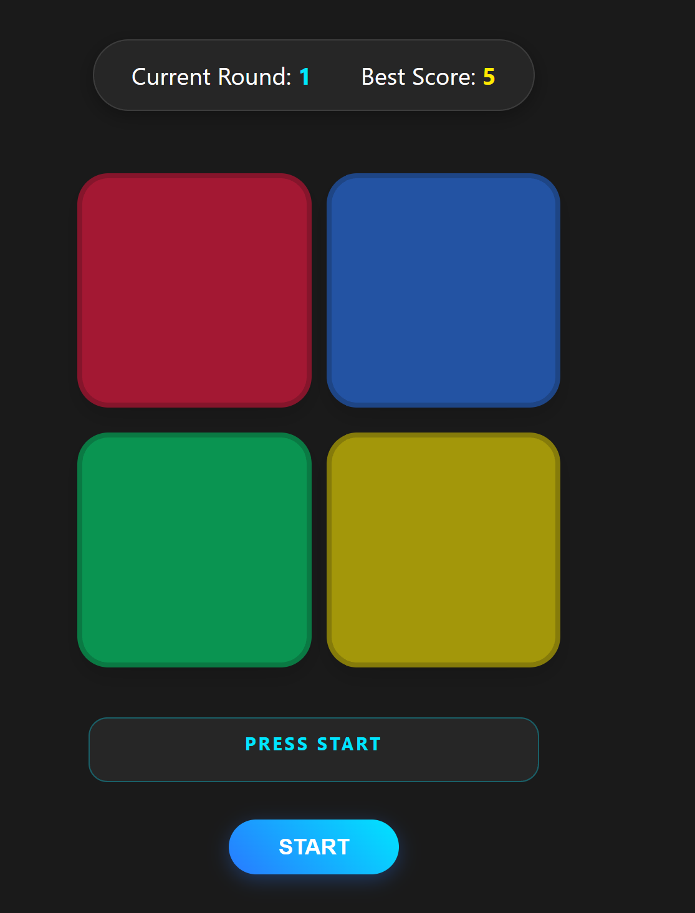

# 🔍 Interactive Posts Feed

> 🚀 **Live Demo:** [Watch the demo in the browser]()

# 🧠 Simon Says Memory Game

An interactive, web-based adaptation of the classic **Simon Says** memory pattern game built with Vanilla JavaScript, Async/Await Promises, and CSS3.

---

## 📋 About the Game

**Simon Says** is a classic memory game where players must repeat increasingly long sequences of flashing colored lights.

### 🎮 How to Play

1. Click **START** to begin the game.
2. Observe the generated sequence of glowing cards.
3. Repeat the exact sequence by clicking the cards in the same order.
4. If you enter the sequence correctly, the game advances to the next round, adding a new step to the sequence.
5. If you click an incorrect card, the game resets, and your best score is updated and saved.

---

## ✨ Key Features

- ⚡ **Asynchronous Animation Queue**: Smooth card-flashing sequences managed using custom Promise delays and `async/await`.
- 🏆 **High Score Persistence**: Automatically saves and retrieves the player's best record across sessions using `LocalStorage`.
- 🎨 **Sleek Modern UI**: Dark-themed aesthetic featuring glowing CSS box-shadow effects, card hover feedback, and status state indicators.
- 🔒 **Input Safeguards**: Board interaction is temporarily disabled during sequence playback to prevent accidental user input.

---

## 🛠️ Tech Stack

- **HTML5**: Semantic game container and score dashboard structure.
- **CSS3**: CSS Grid layout, custom typography, status animations, and glow transitions.
- **JavaScript (ES6+)**:
  - `async / await` for sequence delays and visual animations.
  - Event Listeners and DOM manipulation.
  - Native `LocalStorage` for high-score retention.

---
